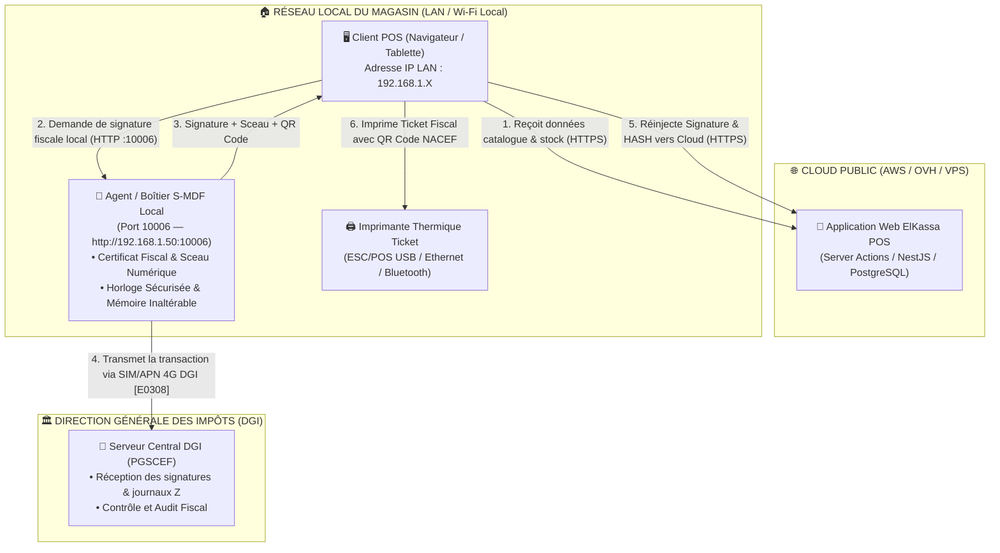
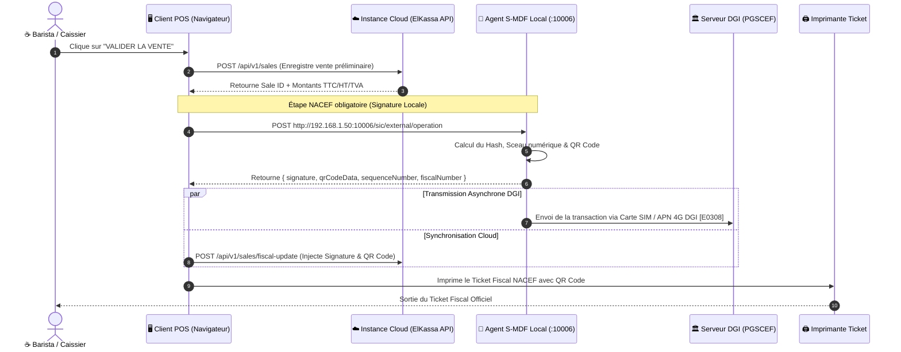
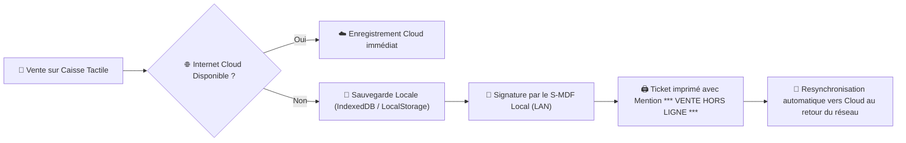

# Architecture & Guide de Connexion NACEF / S-MDF pour Instance Cloud
> **Réf. Réglementaire :** Cahier des Charges NACEF v1.2 — Direction Générale des Impôts (DGI)  
> **Exigence Principale :** `[E0308]` (Liaison Réseau Mobile APN Dédié DGI)  
> **Application :** ElKassa POS / CoffeeShop B2B  
> **Date :** Septembre 2026

---

## 1. Cadre Réglementaire & Principe Général

Le Cahier des Charges NACEF (Notice d'Architecture des Caisses Enregistreuses Fiscales) élaboré par la DGI impose des contraintes de sécurité strictes pour toute transaction commerciale à valeur fiscale :

1. **Exigence `[E0308]` (Réseau APN Dédié)** :  
   Toute transmission vers le **PGSCEF** (Plateforme de Gestion des Caisses Enregistreuses Fiscales de la DGI) doit transiter obligatoirement par une connexion cellulaire **3G/4G via un APN privé sécurisé** configuré sur la puce SIM fournie/accréditée par la DGI.

2. **Rôle de l'Instance Cloud (SaaS)** :  
   Dans une architecture SaaS Multi-Tenant Cloud (ex: `https://www.elkassa.com`), le serveur Cloud centralise le catalogue produit, les stocks, la comptabilité et les données POS.  
   **Cependant, le serveur Cloud ne possède pas directement la carte SIM APN DGI**. C'est le **Client POS (l'application web sur le LAN du magasin)** qui sert de pont avec l'**Agent/Boîtier S-MDF Local**.

---

## 2. Schématisation Globale de l'Architecture

### 📐 Diagramme des Composants & Réseaux



---

## 3. Diagramme de Séquence de l'Encaissement



---

## 4. Prise en Charge du Mode Hors-Ligne (Offline)

Si le réseau Internet du magasin ou l'instance Cloud est temporairement indisponible :



---

## 5. Extrait de Code Technique d'Intégration

### Client NACEF S-MDF Local (`lib/nacef-local-client.ts`)

```typescript
export interface NacefSignRequest {
  storeId: string;
  saleId: string;
  totalTtc: number;
  totalHt: number;
  totalTva: number;
  items: Array<{ name: string; qty: number; priceTtc: number; taxRate: number }>;
}

export async function signTicketWithLocalSMDF(
  smdfUrl: string, // Ex: "http://192.168.1.50:10006"
  payload: NacefSignRequest
) {
  const smdfPayload = {
    operationType: 'SALE',
    timestamp: new Date().toISOString(),
    amountTTC: payload.totalTtc,
    amountHT: payload.totalHt,
    amountVAT: payload.totalTva,
    itemsCount: payload.items.reduce((acc, i) => acc + i.qty, 0),
    items: payload.items.map(item => ({
      label: item.name,
      quantity: item.qty,
      unitPriceTTC: item.priceTtc,
      vatRate: item.taxRate * 100 // Ex: 19 pour 19%
    }))
  };

  const response = await fetch(`${smdfUrl}/sic/external/operation`, {
    method: 'POST',
    headers: { 'Content-Type': 'application/json' },
    body: JSON.stringify(smdfPayload)
  });

  if (!response.ok) {
    throw new Error(`Erreur S-MDF Local : HTTP ${response.status}`);
  }

  const data = await response.json();
  return {
    signature: data.signature || data.digitalSeal,
    qrCodeData: data.qrCode || data.qrCodeData,
    sequenceNumber: data.sequenceNumber,
    fiscalNumber: data.fiscalNumber
  };
}
```

---

## 6. Synthèse des Éléments de Conformité Ticket NACEF

Tout ticket généré en conformité NACEF doit obligatoirement comporter :

1. **Raison Sociale & Matricule Fiscal** de l'établissement.
2. **Identifiant Unique de la Caisse (IMDF)** & numéro de série.
3. **Numéro de Séquence Inaltérable** attribué par le S-MDF.
4. **Tableau de Ventilation des Taxes** (HT, TVA 7% / 19%, Timbre Fiscal 0,100 TND).
5. **QR Code NACEF** encodé et scannable par la DGI.
6. **Badge Spécifique** en cas de duplicata (`*** DUPLICATA - COPIE TICKET ***`) ou d'opération hors-ligne (`*** VENTE HORS LIGNE (OFFLINE) ***`).

---

## 7. Conformité aux Annexes A4 & A5 du CDC NACEF (Codification des Taxes)

Conformément à la réglementation de la DGI (Notice NACEF Annexes A4 et A5) :

### 📊 Annexe A4 : Taux de TVA applicables par Activité (Cafés, Pâtisserie, Restauration, Salons de Thé)
- **Code Activité `4409` (Cafés 1ère Catégorie)** / **`4417` (Salons de Thé)** / **`2102` (Pâtisserie & Glace)** / **`4403` (Pizzerias, Crêperies, Sandwicheries)** :
  - Famille `01` : Tous les produits de consommation sur place ➔ **TVA 7%**
- **Code Activité `4410` (Cafés & Bars)** / **`4401` (Restaurants)** :
  - Famille `01` / `02` : Produits de consommation sur place (hors alcool) ➔ **TVA 7%**
  - Famille `10` : Produits alcooliques ➔ **TVA 19%**

### 🏷️ Annexe A5 : Tableau Officiel de Codification des Taxes
| Code Taxe NACEF | Libellé Officiel | Taux / Valeur | Application dans ElKassa POS |
| :--- | :--- | :--- | :--- |
| **`10`** | **TVA 7%** | **7.00%** | Consommation sur place (café, thé, pâtisserie, repas) |
| **`11`** | **TVA 19%** | **19.00%** | Produits emportés / vente au détail / alcools |
| **`20`** | **Droit de timbre sur franchises** | **0.100 DT** | Timbre fiscal obligatoire par ticket fiscalisé |

